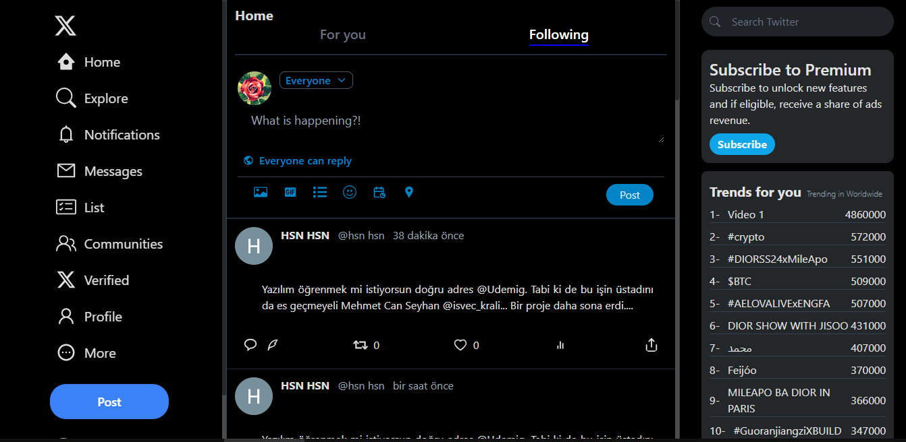

# React + Vite  + Tailwind

## Bu proje, React, Vite ve Tailwind CSS kullanılarak geliştirilen bir Twitter klonunu içermektedir. 
- Proje aynı zamanda Firebase'i kullanarak giriş işlevselliği ve tweet verilerini saklamak için bir veritabanı sunmaktadır.

## Özellikler

- Google ve GitHub ile giriş
- Tweet mesajı gönderme
- Tweet silme ve düzenleme (sadece tweeti yazan kişi tarafından)
- Tweetlere resim ekleme ve resmi değiştirme (sadece tweeti yazan kişi tarafından)
- Tweetleri "like" yapma ve like'ları renklendirme
- Like'ları kaldırma
- Retweet işlevselliği ve retweet sonrası retweet bilgisi paylaşma
- Retweet yapma ve geri alma
- Dünya genelinde ve Türkiye'de trendlerin görüntülenmesi
- Follower ve following listesi
- Tweetlere yorum yazma ve yorumları görüntüleme
- Mesaj karakter sınırlaması (160 karakter)
- Uyarı mesajları ve Toastify bildirimleri

# Kütüphneler
- react-router-dom
- react-icons
- react-toastify
- firebase
- moment
- uuid

API : RapidApi
- url: 'https://twitter154.p.rapidapi.com/user/following',
- url: 'https://twitter-trends5.p.rapidapi.com/twitter/request.php',
- url: 'https://twitter154.p.rapidapi.com/user/following',
- url: 'https://twitter154.p.rapidapi.com/user/followers',

## Önizleme

# TwitterClone-Firebase-Tailwind-ReactVite
